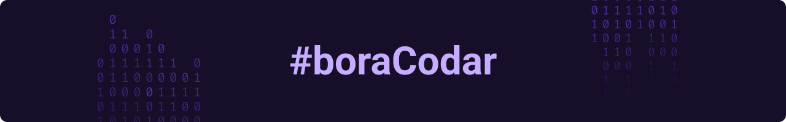
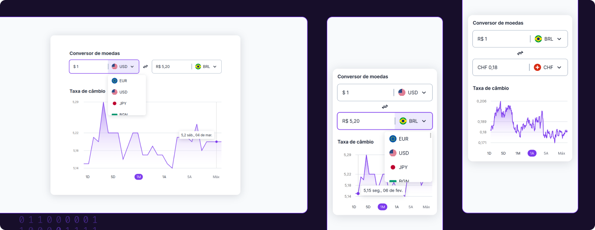

<h1 align="center">Conversor de moedas</h1>

Essa é minha solução para o desafio Conversor de moedas do projeto [#boraCodar](https://www.rocketseat.com.br/boracodar) da RocketSeat.

## :dizzy: A solução do desafio está disponível através deste [**Link.**](https://bora-codar-conversor-de-moedas.vercel.app/)

## :sparkles: O desafio

O desafio consiste em desenvolver um conversor de moedas, sendo possível escolher qual tecnologia utilizar, para esse desafio acabei utilizando o framework Next.js e a Free Currency API.

## :framed_picture: Screenshots



## :computer: Tecnologias utilizadas

- [Next.js](https://nextjs.org/)
- [React](https://pt-br.reactjs.org/)
- [Typescript](https://www.typescriptlang.org/)
- [Recharts](https://recharts.org/)
- [react-currency-flags](https://www.npmjs.com/package/react-currency-flags)
- [Free Currency Conversion API](https://freecurrencyapi.com/)

## :construction_worker: Como Executar

```bash
# Clone o repositório
git clone https://github.com/IgoCarvalho/bora-codar.git
```

```bash
# Entre na pasta do projeto
cd bora-codar/09-conversor-de-moeda
```

```bash
# Instale as dependências
yarn
```

```bash
# Execute o projeto
yarn dev
```

Pronto :tada: agora abra [http://localhost:3000](http://localhost:3000) em seu navegador favorito.

## :technologist: Autores

<table>
  <tr>
    <td align="center">
      <a href="https://github.com/IgoCarvalho">
        
        <br />
        <sub>
          <b>Igo Carvalho</b>
        </sub>
      </a>
      <br />
      <a href="https://www.linkedin.com/in/igocarvalho/" title="LinkedIn" target="_blank">@igocarvalho</a>
    </td>
    <td align="center">
      <a href="https://github.com/rocketseat/" target="_blank">
        
        <br>
        <sub>
          <b>Rocketseat</b>
        </sub>
      </a>
      <br />
      <a href="https://www.rocketseat.com.br/" title="Rocketseat Website" target="_blank">@rocketseat</a>
    </td>
  </tr>
</table>

---

<p align="center">
  Feito com 💜 por <a href="https://github.com/IgoCarvalho">Igo Carvalho</a>
</p>
