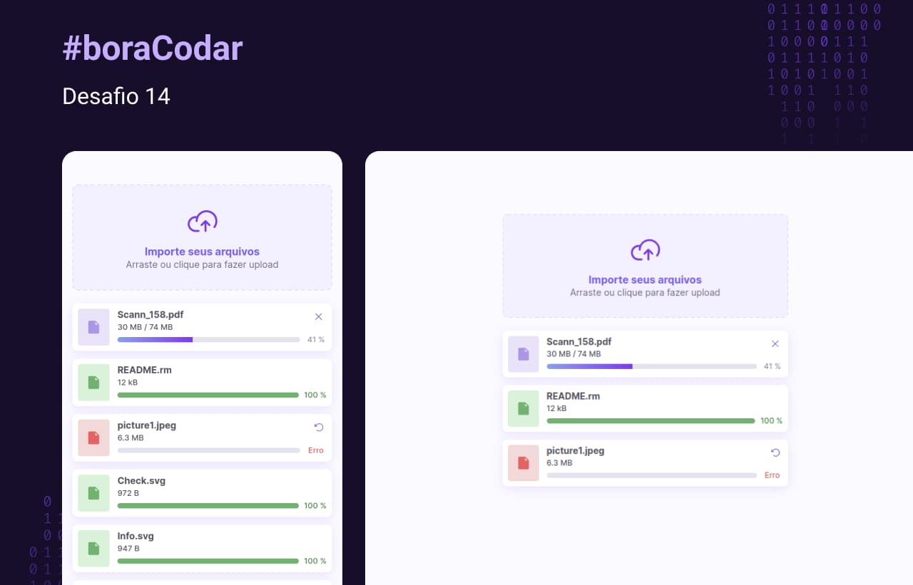

<h1 align="center">Desafio 14 - File uploader</h1>

<p align="center">Essa é minha solução para o desafio File uploader do projeto <a href="https://www.rocketseat.com.br/boracodar">#boraCodar</a> da RocketSeat.</p>

<h2 align="center">
  <a href="https://14-file-uploader.netlify.app/">🔹 Acesse o site através deste link. 🔹</a>
</h2>

## :sparkles: O desafio

O desafio consiste em desenvolver uma pagina para upload de arquivos diversos, era possível escolher qual tecnologia utilizar, então para esse desafio acabei utilizando Vue.js com Composition API.

## :framed_picture: Screenshots



## :computer: Tecnologias utilizadas

- [Vue.js](https://vuejs.org/)
- [Typescript](https://www.typescriptlang.org/)
- [Sass](https://sass-lang.com/)
- [Vite](https://vitejs.dev/)

## :construction_worker: Como Executar

```bash
# Clone o repositório
git clone https://github.com/IgoCarvalho/bora-codar.git
```

```bash
# Entre na pasta do projeto
cd bora-codar/14-file-uploader
```

```bash
# Instale as dependências
yarn
```

```bash
# Execute o projeto
yarn dev
```

Pronto :tada: agora abra [http://localhost:5173](http://localhost:5173) em seu navegador favorito.

## :technologist: Autores

<table>
  <tr>
    <td align="center">
      <a href="https://github.com/IgoCarvalho">
        
        <br />
        <sub>
          <b>Igo Carvalho</b>
        </sub>
      </a>
      <br />
      <a href="https://www.linkedin.com/in/igocarvalho/" title="LinkedIn" target="_blank">@igocarvalho</a>
    </td>
    <td align="center">
      <a href="https://github.com/rocketseat/" target="_blank">
        
        <br>
        <sub>
          <b>Rocketseat</b>
        </sub>
      </a>
      <br />
      <a href="https://www.rocketseat.com.br/" title="Rocketseat Website" target="_blank">@rocketseat</a>
    </td>
  </tr>
</table>

---

<p align="center">
  Feito com 💜 por <a href="https://github.com/IgoCarvalho">Igo Carvalho</a>
</p>
